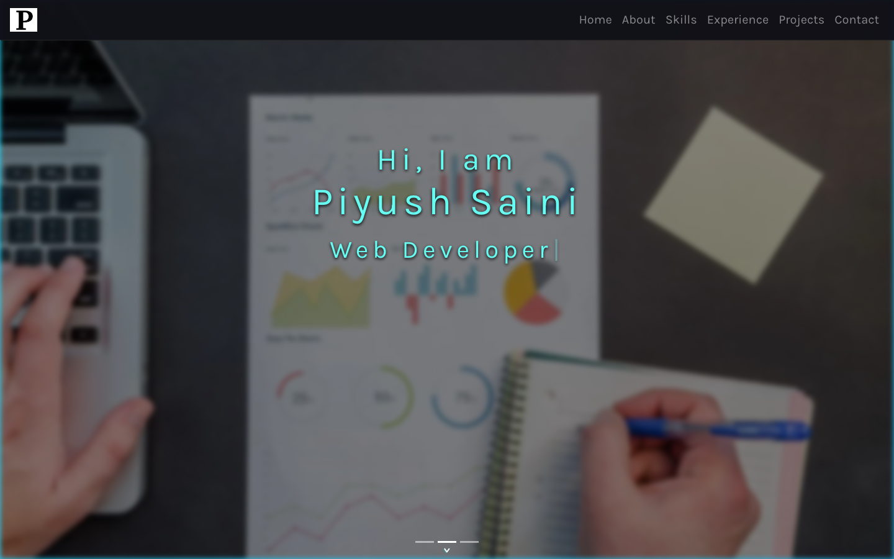

# Portfolio

Personal developer portfolio with a terminal-style hero section and a Gemini-powered chatbot that answers questions about my work.

**Live:** [my-portfolio1.vercel.app](https://my-portfolio1.vercel.app)



## Stack

- Next.js 14 (App Router) · React · TypeScript
- Tailwind CSS · Framer Motion
- Google Generative AI (Gemini) — the in-page chatbot

## Sections

- Interactive terminal-style hero
- About, Experience, Tech Stack, Projects, Contact
- `/api/chat` — Gemini-backed Q&A about my background

## Development

```bash
npm install
npm run dev     # http://localhost:3000
npm run build   # production build
```

Set `GEMINI_API_KEY` in `.env.local` for the chatbot to work locally.
